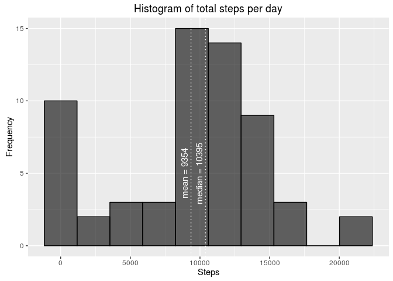
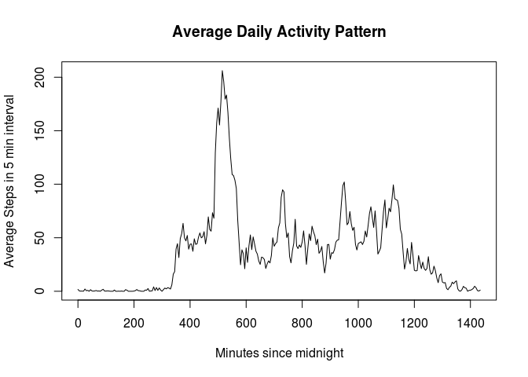
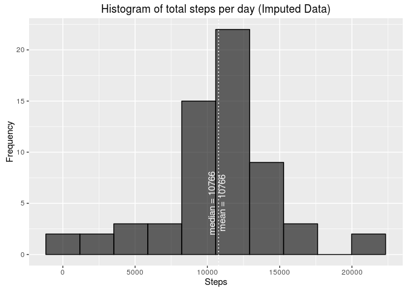
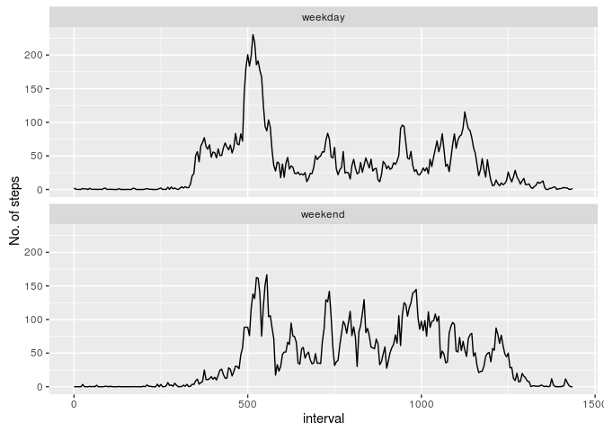

# Reproducible Research: Peer Assessment 1


## Loading and preprocessing the data
The data is loaded using `read.csv` and stored in a variable `activity`

```r
library(dplyr)
```

```
## 
## Attaching package: 'dplyr'
```

```
## The following objects are masked from 'package:stats':
## 
##     filter, lag
```

```
## The following objects are masked from 'package:base':
## 
##     intersect, setdiff, setequal, union
```

```r
activity <- read.csv("activity.csv")
#format column "date" as date
#format column "interval" into minutes from midnight
activity$date <- as.Date(activity$date,"%Y-%m-%d")
activity <- activity %>%
  mutate(interval= (interval%%100+60*(interval%/%100)))
```


## What is mean total number of steps taken per day?
Total number of steps per day is calculated and stored in `daily_stats`

```r
daily_stats <- activity %>%
                group_by(date) %>%
                summarise(total = sum(steps, na.rm=TRUE))
```


Calculate the mean and plot a histogram


```r
mean_daily <- mean(daily_stats$total, na.rm=T)
median_daily <- median(daily_stats$total, na.rm=T)

library(ggplot2)
g1 <- ggplot(data=daily_stats, aes(daily_stats$total)) +
  labs(x="Steps", y="Frequency") +
  ggtitle("Histogram of total steps per day") +      
  geom_histogram(bins=10, col="black", 
                 fill="black", 
                 alpha = .6) +
  geom_vline(xintercept=median_daily, col="white", linetype="dotted") + 
  annotate("text", label = paste("median =",round(median_daily,0)), 
           x = median_daily, y = 5, vjust=-0.5, size = 4, angle=90, 
           colour = "white") +
  geom_vline(xintercept=mean_daily, col="white", linetype="dotted") + 
  annotate("text", label = paste("mean =",round(mean_daily,0)), 
           x = mean_daily, y = 5, vjust=-0.5, size = 4, angle=90, 
           colour = "white")

g1
```

<!-- -->

Total daily steps has a **Mean of 9354 **and a **Median of 10395**     


## What is the average daily activity pattern?

```r
stats_5min <- activity %>%
  group_by(interval) %>%
  summarise(average = mean(steps, na.rm=TRUE))

plot(stats_5min$interval, stats_5min$average, type="l", 
     xlab="Minutes since midnight", ylab="Average Steps in 5 min interval",
     main="Average Daily Activity Pattern")
```

<!-- -->

```r
max_steps_interval <-  with(stats_5min, 
                            interval[which(average == max(average))])
```

The 5 minute interval with **maximum average steps** across all days occurs at 
**8 hrs and 35 minutes.** 


## Imputing missing values

```r
na_count <- sum(!complete.cases(activity))
```
The date set has **2304 rows** with missing data.


```r
# imputing value as average of the 5-minute interval
activity_imp <- activity
for (i in 1:nrow(activity_imp)) {
  if (is.na(activity_imp$steps[i])) {
    activity_imp$steps[i] <- stats_5min$average[which(
        stats_5min$interval ==
          activity_imp$interval[i])]
  }
}


# daily stats imputed
daily_stats_imputed <- activity_imp %>%
                group_by(date) %>%
                summarise(total = sum(steps, na.rm=TRUE))

mean_daily_imp <- mean(daily_stats_imputed$total)
median_daily_imp <- median(daily_stats_imputed$total)

# plot original histogram
g1
```

<!-- -->

```r
# plot histogram on imputed data
ggplot(data=daily_stats_imputed, aes(daily_stats_imputed$total)) +
  labs(x="Steps", y="Frequency") +
  ggtitle("Histogram of total steps per day (Imputed Data)") +      
  geom_histogram(bins=10, col="black", 
                 fill="black", 
                 alpha = .6) +
  geom_vline(xintercept=median_daily_imp, col="white", linetype="dotted") + 
  annotate("text", label = paste("median =",round(median_daily_imp,0)), 
           x = median_daily_imp, y = 5, vjust=-0.5, size = 4, angle=90, 
           colour = "white") +
  geom_vline(xintercept=mean_daily_imp, col="white", linetype="dotted") + 
  annotate("text", label = paste("mean =",round(mean_daily_imp,0)), 
           x = mean_daily_imp, y = 5, vjust=+1.0, size = 4, angle=90, 
           colour = "white")
```

<!-- -->

Total daily steps on original data has a **Mean of 9354** and a **Median of 10395**     

Total daily steps on imputed data has a **Mean of 10766** and a **Median of 10766**     


## Are there differences in activity patterns between weekdays and weekends?

```r
activity_imp$day <- as.factor(ifelse(weekdays(activity_imp$date) 
                                  %in% c("Saturday", "Sunday"), 
                                  "weekend", "weekday"))

stats_5min_imp <- activity_imp %>%
  group_by(day, interval) %>%
  summarise(average = mean(steps, na.rm=TRUE))

ggplot(data=stats_5min_imp, aes(x=interval, y=average))+ ylab("No. of steps") +
  geom_line()+facet_wrap(~day, ncol=1)
```

<!-- -->
